<div align="center">
  <a href="https://twitter.com/shironappa_">
      
  </a>
  <p>Tranh bởi Shironpapa</p>
  <h1>Ugoku-v2 Discord Bot (Việt hoá)</h1>
</div>

**Một bản làm lại đang tiền hành của [Ugoku !](https://github.com/Shewiiii/Ugoku-bot)**, được thiết kế lại hoàn toàn, và nhẹ hơn~  
Cảm ơn [Chinono](https://github.com/ChinHongTan) một lần nữa vì đã giúp mình trong dự án đó, yêu lắm <3

<h2>Tính năng / Việc cần làm</h2>

- [X] Ping.
- [X] Echo tin nhắn (làm cho bot nói bất kỳ tin nhắn nào).
- [X] Tải nhãn dán từ Line.
- [X] Tải bài hát, album hoặc danh sách phát từ Spotify. (WIP)
- [X] Phát bài hát trong kênh thoại.
  - [X] Bỏ qua, Hiển thị hàng đợi, Tự động phát hiện và thêm bài hát/album hoặc danh sách phát.
  - [X] Lặp lại bài hát, hàng chờ, tạm dừng, tiếp tục...
  - [X] Chất lượng âm thanh tuyệt vời: bỏ qua tốc độ bit âm thanh của kênh.
  - [X] Phát trực tuyến bài hát từ Spotify.
  - [X] Phát trực tuyến video từ Youtube.
  - [X] Phát trực tuyến các tác phẩm âm thanh (音声作品) trong kênh thoại (tại sao không).
  - [X] Phát bài hát từ URL (nguồn tùy chỉnh).
  - [X] Lưu trữ âm thanh từ các nguồn tùy chỉnh.
  - [X] Nhúng thông tin trong tin nhắn với siêu dữ liệu.
  - [X] Hiển thị lời bài hát bằng API musixmatch.
  - [ ] (đã lỗi thời) Điều khiển bot bằng [UI tuyệt với này](https://github.com/ChinHongTan/Ugoku-frontend) !


- [X] Trò chuyện bằng Gemini 1.5 Pro. (WIP)
  - [ ] Tối ưu hóa việc sử dụng token.
  - [X] Làm cho tin nhắn giống con người hơn.
  - [X] Có trí nhớ vĩnh viễn!
- [ ] Và có thể nhiều hơn nữa trong tương lai~

<h2>Sân chơi bot</h2>

Các tính năng chatbot và Spotify đã tắt, nhưng bạn vẫn có thể chơi với bot ở đây
 [Link mời](https://discord.com/oauth2/authorize?client_id=1260656795974897695)

<h2>Ảnh minh hoạ</h2>

<div align="center">
  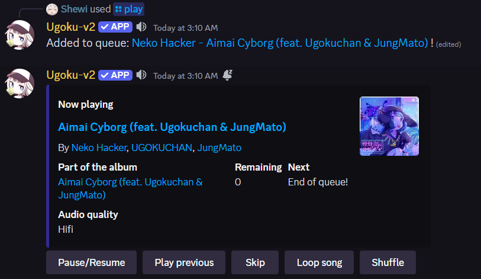
  <p>Phát bài hát</p>
  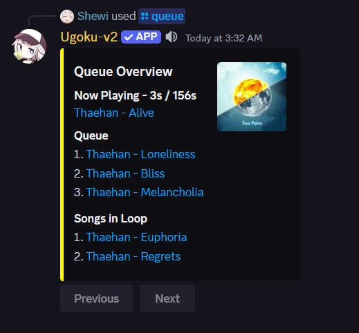
  <p>Bài hát trong hàng chờ</p>
  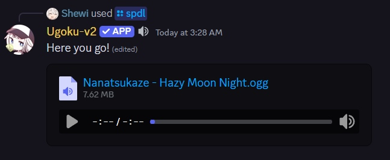
  <p>Tải nhạc từ Spotify</p>
  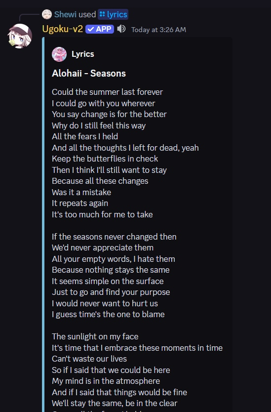
  <p>Lời bài hát</p>
  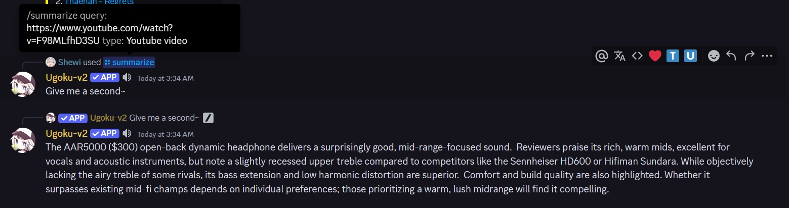
  <p>Tóm tắt văn bản và video YouTube</p>
  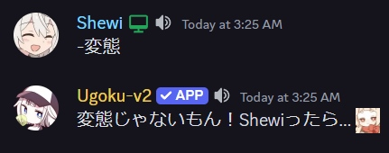
  <p>Tin nhắn ngẫu nhiên :))</p>
</div>

<h2>Các lỗi đã biết cần sửa</h2>

- Hàng đợi không hiển thị khi có quá nhiều ký tự trong phần hàng đợi/vòng lặp. (hầu hết là trường hợp với onsei) ("Trong data.embeds.0.fields.1.value: Phải có độ dài 1024 hoặc ít hơn.").

<h2>Điểm chuẩn âm thanh</h2>

> [!LƯU Ý]
> Deezer cuối cùng đã được tích hợp vào Ugoku! Nội dung âm thanh không mất dữ liệu giờ đây sẽ được đưa vào các bản nhạc Spotify trước khi phát (khi có sẵn). Ugoku hiện cung cấp chất lượng âm thanh tốt nhất có thể cho bot Discord, gần như không thể phân biệt được với âm thanh không mất dữ liệu thực sự...ngoại trừ độ trễ thỉnh thoảng.

> Tham chiếu chuẩn:
> - Bản nhạc tham chiếu: Ayiko - Tsundere Love
> - Nguồn tham chiếu: Deezer, FLAC
> - Phần mềm so sánh: Deltawave
> - Thời gian: ~0-30 giây
> - Chuẩn hóa biên độ: -10dBFS
> - Chuẩn hóa bằng: Audacity
> - Giảm mẫu bằng: Audacity
> - Ghi bằng: Cáp Hi-Fi VB-Audio (Cáp ảo với bit hoản hảo, Jockie)
> - Chuyển đổi bằng: FFmpeg (Ugoku)
> - Phương pháp ghi:
> - Ugoku: Chuyển đổi bằng FFmpeg với chuỗi âm thanh tương ứng
> - FLAC -> Ogg 320 -> Opus 510 (chất lượng "cao")
> - FLAC -> Opus 510 (chất lượng "Hifi")
> - Jockie: Ghi âm đầu ra âm thanh của Discord bằng cáp ảo
> - Chất lượng âm thanh:
> - Ugoku: Cao (Spotify), Hifi (Deezer)
> - Jockie: Không có đăng ký Patreon cho Jockie

<h2>Kết quả:</h2>

<div align="center">
<h2>Delta của quang phổ (Giá trị tuyệt đối thấp hơn là tốt hơn)</h2>
<h3>Ugoku, Chất lượng Hifi:</h3>
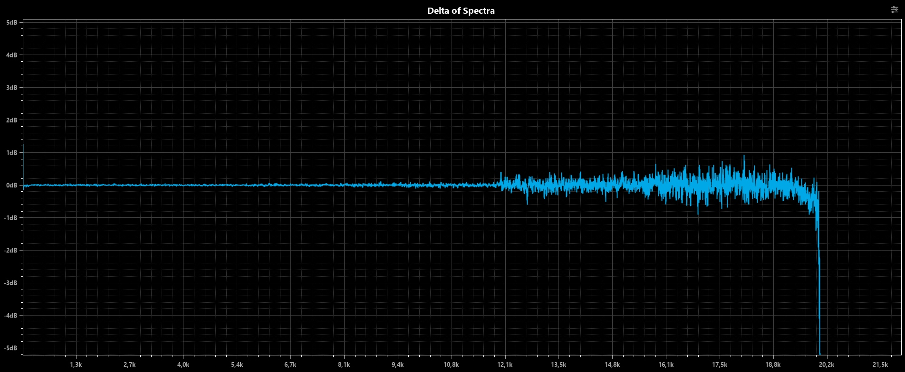
<h3>Ugoku, Chất lượng cao:</h3>
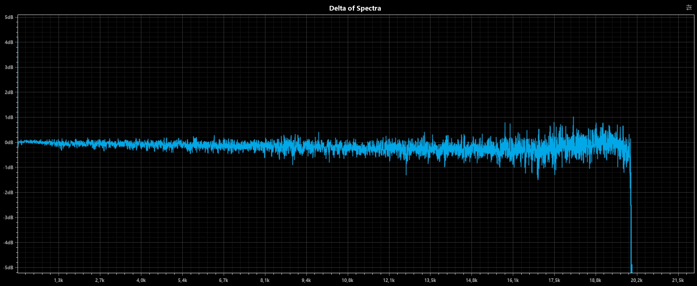
<h3>Jockie:</h3>
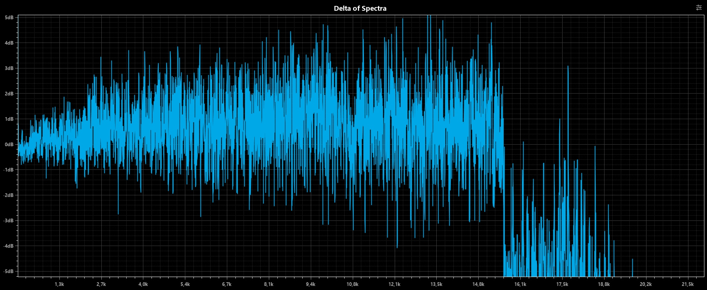
<h2>Dạng sóng Delta (Thấp hơn là tốt hơn)</h2>
<h3>Ugoku, Chất lượng Hifi:</h3>
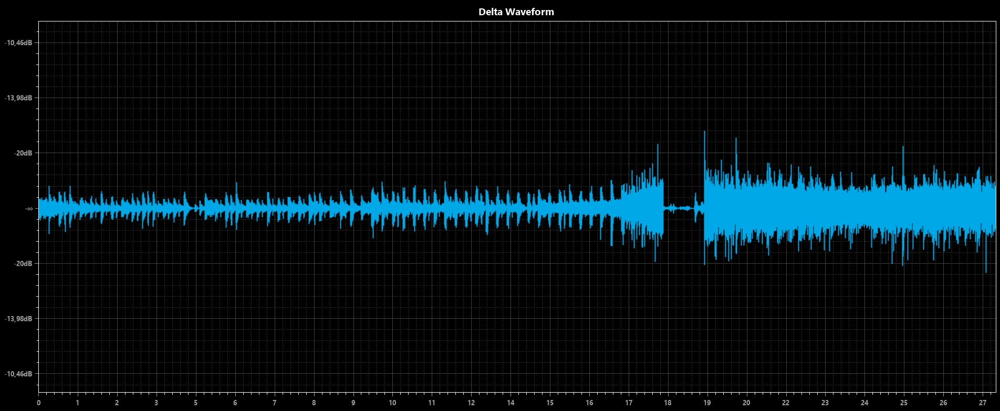
<h3>Ugoku, Chất lượng cao:</h3>
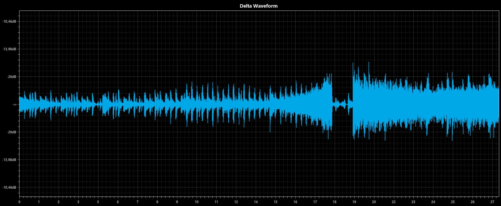
<h3>Jockie:</h3>
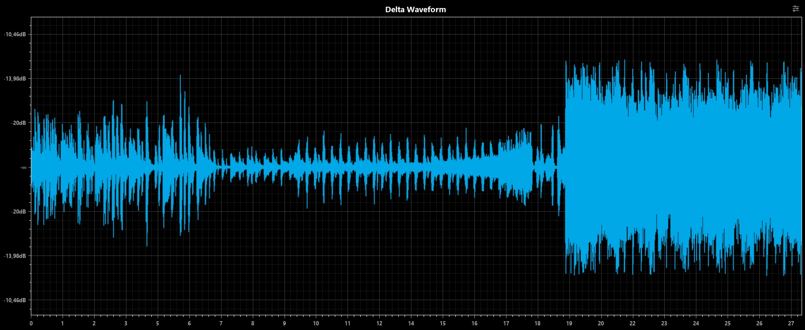
<h2>Phổ delta (Càng thấp càng tốt)</h2>
<h3>Ugoku, Chất lượng Hifi:</h3>
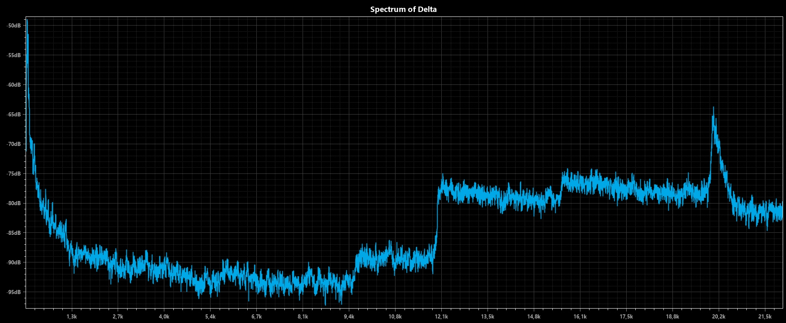
<h3>Ugoku, Chất lượng cao:</h3>
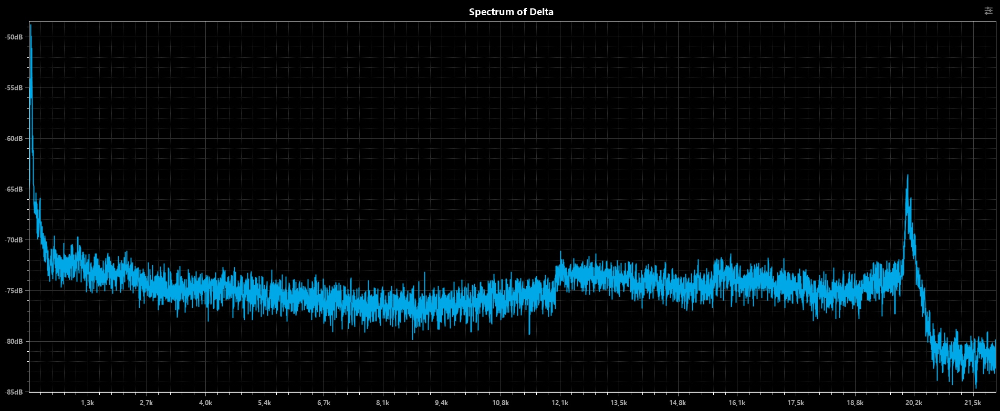
<h3>Jockie:</h3>
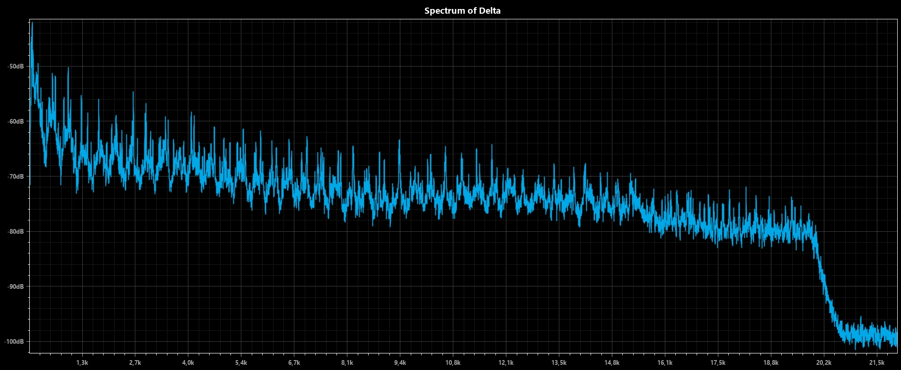
</div>


<h2>Hướng dẫn cài đặt</h2>

>[!NOTE]
> Hướng dẫn này được thực hiện trước khi tính năng Deezer được phát triển, vui lòng tham khảo repository gốc để được cách thêm tính năng Deezer vào bot.
<h4> API Discord (API chính, dùng để bot sống dậy :)) )</h4>

- Vào trang cho nhà phát triền Discord tại link sau: <a href="https://discord.com/developers/applications" > Cổng cho lập trình viên Discord </a>
- Nhấp vào nút **New Application** (Ứng dụng mới).
<p></p>
<div align = "center">

</div>
<p></p>
- Đặt tên cho ứng dụng và nhấp vào <b> Create </b>
<p></p>
<div align = "center">

</div>
<p></p>
- Ở thanh bên trái, chọn Installation và đảm bảo thiết lập của bạn giống như trong ảnh. Sau khi chỉnh sửa, nhấn vào nút **Save Changes** để lưu các thay đổi. Hãy chú ý đường dẫn trong mục **Install Link**, bạn sẽ sử dụng đường dẫn này để thêm bot vào máy chủ của mình.
<p></p>
<div align = "center">

</div>
<p></p>
- Tiếp tục, vào mục Bot ở thanh bên trái, thêm, chỉnh sửa tên, ảnh đại diện, banner cho bot, và nhấn vào nút **Reset Token** để lấy token cho bot. Sau khi token hiển thị, sao chép nó và dán vào mục ```BOT_TOKEN``` trong file .env
<p></p>
<div align = "center">

</div>
<p></p>

>[!NOTE]
>Cần lưu ý rằng token này thực chất là mật khẩu bot của bạn. Bạn không bao giờ nên chia sẻ điều này với người khác vì khi làm như vậy, ai đó có thể đăng nhập vào bot của bạn và thực hiện các thao tác độc hại, chẳng hạn như rời khỏi máy chủ, cấm tất cả thành viên bên trong máy chủ hoặc tấn công mọi người một cách ác ý. Nếu bạn vô tình làm rò rỉ token của mình, hãy nhấp vào nút “Regenerate” (Tạo lại) càng sớm càng tốt. Thao tác này thu hồi token của bạn và tạo lại token mới để đăng nhập. 

<h4> API Spotify (Nếu bạn muốn sử dụng tính năng Spotify)</h4>

- Vào trang dành cho nhà phát triển của Spotify và đăng nhập bằng tài khoản Spotify của bạn **(Phải đang sử dụng Spotify Premium)**: https://developer.spotify.com/dashboard và tạo tài khoản
- Nhấn vào nút **Create App**
<p></p>
<div align = "center">

</div>
<p></p>
- Nhập tên, mô tả, URL dẫn về (cái này nhập đại cũng được), chọn đúng loại SDK như trong ảnh, hiểu và chấp nhận với điều khoản của Spotify và nhấn **Save**
<p></p>
<div align = "center">

</div>
<p></p>
- Sau khi tạo ứng dụng thành công, trở về Dashboard, lúc này sẽ có ứng dụng của bạn hiện lên. Nhấn vào nó và vào phần **Settings**
<p></p>
<div align = "center">

</div>
<p></p>
- Ở dầu trang, nhấn vào nút **View client secret**
<p></p>
<div align = "center">

</div>
<p></p>
- Lúc này, sao chép các dòng Cient ID và Client secret và lưu nó
<p></p>
<div align = "center">

</div>
<h4> API Gemini + Pinecone (Nếu bạn muốn sử dụng các tính năng liên quan đến AI bao gồm chatbot và dịch lời bài hát) </h4>
- Vào trang lấy tạo khoá API của Google tại đây <a href="https://aistudio.google.com/app/u/1/apikey" > Google API Studio </a>, nhấn vào nút <b> Create API Key </b>, chọn dự án của bạn, và tạo khoá API.

<p></p>
<div align = "center">

</div>
<p></p>

>[!NOTE]
>Hướng dẫn này mặc định rằng bạn đã có một tài khoản Google Cloud và một dự án để sử dụng nó. Nếu bạn chưa có, hãy tạo tại khoản mới tại <a href="https://console.cloud.google.com/welcome/new?hl=vi&inv=1&invt=AbilVg" >đây </a>. Việc sử dụng API Gemini có tính phí, hãy xem biểu mẫu giá tại <a href="https://ai.google.dev/pricing?authuser=1&hl=vi">đây </a>.

- Đối với Pinecone, đăng ký hoặc đăng nhập vào tài khoản của bạn, sau đó chọn vào mục **API Keys** ở thanh bên trái và chọn **Create API key** ở trên góc phải màn hình

<p></p>
<div align = "center">

</div>
<p></p>

- Nhập tên và nhấn **Create key**

<p></p>
<div align = "center">

</div>
<p></p>

- Sao chép khoá API của bạn và dán vào mục ```PINECONE_API``` ở file ```.env```

>[!NOTE]
>Hãy lưu khoá API của bạn thật kỹ, vì không có cách nào để lấy lại khoá API khi quên và bạn phải tạo một khoá mới

<h4> API Imgur (Nếu bạn muốn dùng một nền tảng khác để hiện thị ảnh album) <h4>

- Tạo tài khoản Imgur, và đăng ký một ứng dụng mới tại đây https://api.imgur.com/oauth2/addclient

- Sau khi tạo ứng dụng, hãy sao chép **ID Client** và dán nó vào ```IMGUR_CLIENT_ID``` ở tệp ```.env```

<h3>Tải xuống và chạy bot</h3>

- Tải xuống hoặc nhân bản repository này vào một thư mục trên máy của bạn
```git
git clone https://github.com/TimTCG/Ugoku-v2.git
```
- Nếu bạn đang dùng Python 3.4+, bạn có thể tạo một môi trường ảo của Python trong thư mục đó bằng lệnh sau
```python
python -m venv <thư mục chứa Ugoku>
```
>[!NOTE]
>Nếu bạn gặp lỗi trong quá trình tạo môi trường ảo trên Python, hãy đảm bảo là bạn đã tải gói virtualenv trước nhé. Bạn có thể tải nó bằng lệnh này ```pip install virtualenv``` và dùng ```virtualenv <thư mục chứa Ugoku>``` để tạo môi trường ảo.
- Truy cập vào môi trường ảo của bạn
```
# Đối với Windows
# Trong cmd.exe
<thư mục chứa Ugoku>\Scripts\activate.bat
# Trong PowerShell
<thư mục chứa Ugoku>\Scripts\Activate.ps1
```
```
#Trong Linux
source <thư mục chứa Ugoku>/bin/activate
```
- Truy cập vào các file sau để thay đổi nội dung để phù hợp với môi trường bạn sẽ sử dụng:
  - ```.env.template```: Thêm các giá trị API để bot được hoạt động. Sau khi thêm xong, hãy đổi tên thành ```.env``` để hệ thống ghi nhận
  - ```config.py```: Thiết lập các giá trị cơ bản của bot, bao gồm việc bật/tắt các tính năng Spotify, chatbot
- Sau khi hoàn tất chỉnh sửa, nhập lệnh sau để chạy bot
```python
python main.py
```
>[!NOTE]
> Khi chạy bot lần đầu tiên, nó sẽ yêu cầu bạn hãy đăng nhập vào Spotify trên máy chủ nơi bạn đang host. Hãy kết nối với máy chủ chạy bot thông qua ứng dụng Spotify bằng cách sau:
> - Mở Spotify và phát nội dung bất kỳ.
> - Nhấn vào biểu tượng Kết nối thiết bị ở cuối màn hình.
> - Chọn máy chủ mà bạn đang host bot trên đó.
>> Khi chạy từ lần thứ hai trở đi, bot sẽ sử dụng thông tin mà bạn đã đăng nhập để làm cở sở cho nó hoạt động.

>[!NOTE]
> Khi bạn không tìm thấy máy chủ đang host bot, hãy làm các bước như sau:
> - Tuỳ thuộc vào phiên bản thiết bị chính bạn đang dùng, tải xuống hoặc sao chép repository sau đây vào máy tính của bạn <a href=https://github.com/dspearson/librespot-auth> Link </a>
> - Tải xuống bộ công cụ Rust (Xem https://rustup.rs/), và chạy `cargo build --release`.
> - Sau khi hoàn tất, chạy lênh sau
> ```bash
>$ ./target/release/librespot-auth --name "<tên>" --class=speaker
>Làm theo hướng dẫn kết nối ở trên và chọn "<Tên>" là thiết bị bạn cần kết nối
>```
>Lúc này, bạn sẽ thấy trong thư mục hiện tại có một tệp tên là ```credentials.json```. Mở trính sửa văn bản mà bạn yêu thích, như Notepad hay là Notepad++, hay cái gì cũng được, và sửa lại theo đúng cấu trúc sau:
>```json
>{
>   "username": "tên spotify của bạn, mặc định là dãy chữ cái và số đầu tiên",
>   "credentials": "dòng chữ dài vô cùng ở phía sau, copy hết phần chữ trong dấu ngoặc kép",
>   "type": "AUTHENTICATION_STORED_SPOTIFY_CREDENTIALS"
>}
>```
>Sau khi chỉnh sửa, copy file đó và dán vào thư mục mà bạn đang chứa Ugoku và dùng lệnh ```python main.py``` để chạy lại. Trong trường hợp nó vẫn yêu cầu bạn phải đăng nhập vào Spotify, copy file đó và dán vào thư mục ```bot/vocal``` và chạy lại bot.
