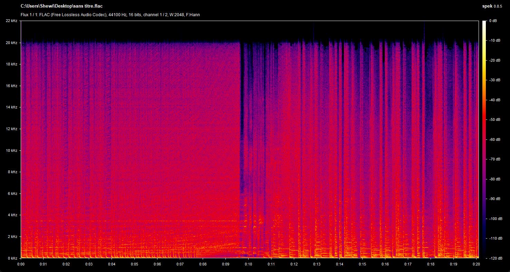
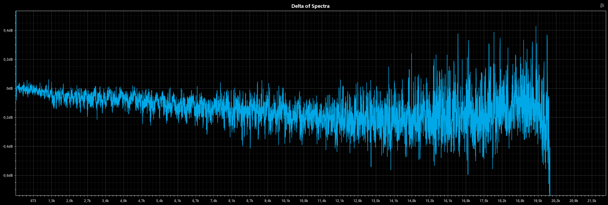
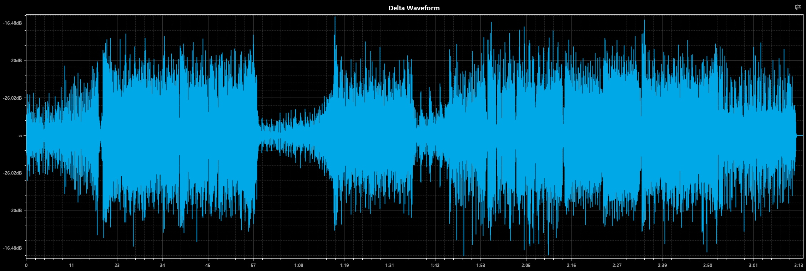

  
  
Tranh bởi Shironpapa

  <h1>Ugoku-v2 Discord Bot (Việt hoá)</h1>

**Một bản làm lại đang tiền hành của [Ugoku !](https://github.com/Shewiiii/Ugoku-bot)**, được thiết kế lại hoàn toàn, và nhẹ hơn~  
Cảm ơn [Chinono](https://github.com/ChinHongTan) một lần nữa vì đã giúp mình trong dự án đó, yêu lắm <3

<h2>Tính năng / Việc cần làm</h2>

- [X] Ping.
- [X] Echo tin nhắn (làm cho bot nói bất kỳ tin nhắn nào).
- [X] Tải nhãn dán từ Line.
- [X] Tải bài hát, album hoặc danh sách phát từ Spotify. (WIP)
- [X] Phát bài hát trong kênh thoại.
  - [X] Bỏ qua, Hiển thị hàng đợi, Tự động phát hiện và thêm bài hát/album hoặc danh sách phát.
  - [X] Lặp lại bài hát, hàng chờ, tạm dừng, tiếp tục...
  - [X] Chất lượng âm thanh tuyệt vời: bỏ qua tốc độ bit âm thanh của kênh.
  - [X] Phát trực tuyến bài hát từ Spotify.
  - [X] Phát trực tuyến video từ Youtube.
  - [X] Phát trực tuyến các tác phẩm âm thanh (音声作品) trong kênh thoại (tại sao không).
  - [X] Phát bài hát từ URL (nguồn tùy chỉnh).
  - [X] Lưu trữ âm thanh từ các nguồn tùy chỉnh.
  - [X] Nhúng thông tin trong tin nhắn với siêu dữ liệu.
  - [X] Hiển thị lời bài hát bằng API musixmatch.
  - [ ] (đã lỗi thời) Điều khiển bot bằng [UI tuyệt với này](https://github.com/ChinHongTan/Ugoku-frontend) !

- [X] Trò chuyện bằng Gemini 1.5 Pro. (WIP)
  - [ ] Tối ưu hóa việc sử dụng token.
  - [X] Làm cho tin nhắn giống con người hơn.
  - [X] Có trí nhớ vĩnh viễn!
- [ ] Và có thể nhiều hơn nữa trong tương lai~

<h2>Các lỗi đã biết cần sửa</h2>

- Hàng đợi không hiển thị khi có quá nhiều ký tự trong phần hàng đợi/vòng lặp. (hầu hết là trường hợp với onsei) ("Trong data.embeds.0.fields.1.value: Phải có độ dài 1024 hoặc ít hơn.").

<h2>Điểm chuẩn âm thanh</h2>

> [!NOTE]
> Ugoku-v2 chỉ sử dụng Spotify làm nguồn dịch vụ phát nhạc trực tuyến, vì vậy chuỗi âm thanh tốt nhất (bên cạnh các nguồn tùy chỉnh) là OGG 320kbps -> Opus 510kpbs. Mình đang có kế hoạch triển khai Deezer làm nguồn phát trực tuyến cho bot, để có được chất lượng âm thanh tốt nhất có thể từ bất kỳ Bot discord nào.

  
  
Spectrogram của đầu ra âm thanh của bot trong bài hát Spotify có chất lượng âm thanh "Rất cao"

  
  
Dự đoán delta so với đường âm thanh không mất dữ liệu (~0,6dB thang y).

  
  
Dạng sóng delta so với đường âm thanh không mất dữ liệu (~-17dBFS thang y).

So sánh với bot âm nhạc khác sẽ thêm vào

